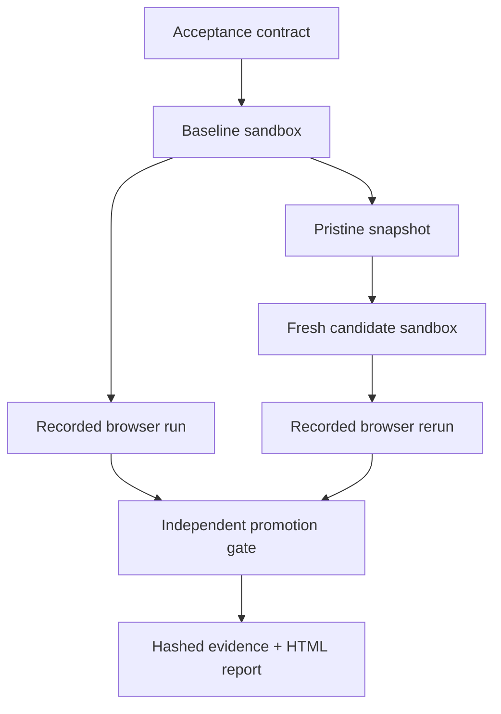

# Forge Solari — evidence-driven application QA

Forge Solari reproduces a web-app failure in a clean Solari sandbox, evaluates it in a recorded Solari browser, forks a pristine snapshot into a fresh candidate sandbox, applies a repair candidate, reruns the same acceptance contract, and emits an independent promotion verdict.

This is intentionally more than a browser script: Solari is the execution substrate for the full failure-to-verdict loop.



## What the demo proves

- The baseline fixture contains two real state bugs: adding one item increments by two, and reset changes the screen without resetting state.
- The acceptance contract checks both the failing behavior and a permanent regression journey.
- Baseline and candidate run sequentially in separate hardware-isolated microVMs created from the same Solari snapshot.
- Each run uses a separate recorded cloud-browser session, screenshots, page errors, console errors, per-step timings, and an asynchronous replay URL.
- A verifier that receives only the two evidence records decides promotion. The repair producer does not approve itself.
- Every report is content-addressed with SHA-256.

## Run offline verification

```bash
npm install
npm test
npm run typecheck
npm run dry-run
```

The dry run exercises contract parsing, evidence evaluation, hashing, and report generation without consuming Solari credit.

## Run the live campaign

Create a free Solari key at [console.getsolari.com](https://console.getsolari.com), then:

```bash
export SOLARI_API_KEY=slr_live_...
npm start
```

The report and machine-readable evidence are written under `artifacts/`. All remote sessions, candidate sandboxes, and the temporary snapshot are destroyed in `finally` blocks.

### Run it without your laptop

The public fork includes the manually triggered **Forge Solari Live Campaign** GitHub Actions workflow. Add `SOLARI_API_KEY` as an encrypted repository secret, open **Actions → Forge Solari Live Campaign → Run workflow**, and download the seven-day evidence artifact after the run. The workflow is read-only, serialized to one campaign at a time, and stops after ten minutes.

## Why this maps to real products

Replace the bundled fixture with a repository clone and map `forge.config.json` to the product's acceptance journeys. The same engine can validate signup, checkout, file upload, dashboards, and authenticated workflows. Repair agents can generate multiple candidate snapshots; Forge ranks them from evidence and promotes only the winner that clears the permanent regression suite.

The next production layer is a GitHub check that accepts a pull request SHA, launches candidates in parallel within a declared cost ceiling, and posts the signed verdict back to the pull request.
